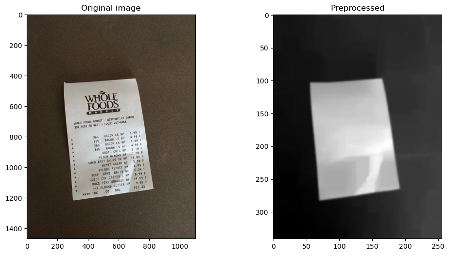
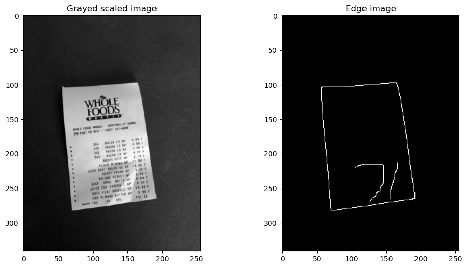
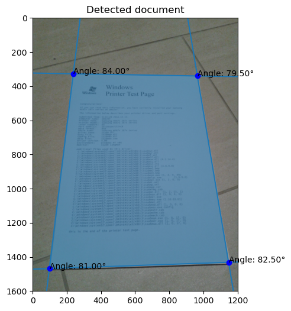
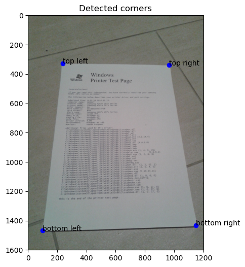
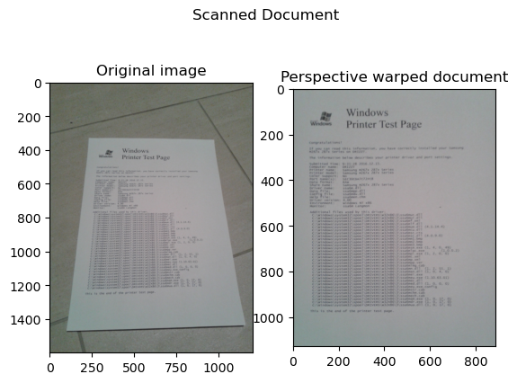
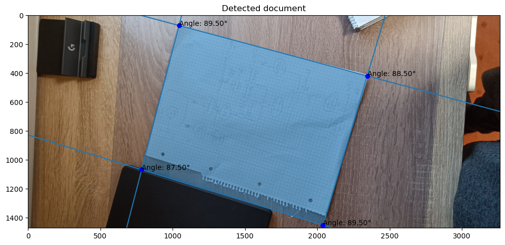

# Document Scanner using CV

This project aims to use Computer vision for detecting documents on an image and warping the image in a way to display the document face on. It uses the Hough Transform for line detection on the image to eventual find the document corners and warping the image.

## How it works

The document detection process is made up of several key steps:

1.  **Preprocessing**  
    To detect the document on the image we need to find the borders of the document and determine its corners to warp the original coordinate space into the face on coordinate space. Doing this on the original image can be quite challenging due to noise and distracting elements on the image like text or background elements. To solve this problem there are multiple preprocessing steps involved before the actual document detection can happen.

    - **Downscaling:**
    The original image can be in any size.
    To reduce computational expense the image will get downscaled to a fixed minimum size, either the width or height, based on the shorter side, while preserving the aspect ratio. 
    - **Grayscale conversion:**
    Converting the rgb image to grayscale is necessary for edge detection which will be used for the Hough Transform. 
    - **Morphology:**
    Applying a closing filter on the grayscaled image to remove small black points (text) on the image,
    followed by a gaussian blur to reduce the noise, which is necessary for better edge detection

2. **Edge detection**  
    The later applied hough transform will find straight lines in the image. But to do this it can't use the grayscaled, it needs an edge map. So we use canny edge detection to detect edges on the image.

3. **Hough Transform**  
    The edge detection will most likely find more edges than just the edges of the document. Elements in the background or other things on the image might also have edges which are present in the edge map.
    So the challenging part is to find out which of these edges correspond to image edges and which are irrelevant.
    Since a document is a rectangle it will have straight edges.
    With the help of the hough transform, we can find straight lines on the edge image.
    The algorithm will return a number of lines depending on how you specify the parameters. Some of them might be long straight lines in the image or just some short elements. To now find the document edges and corners we need to evaluate each of the lines on how likely they might be an edge of the image. This is probably the most important part in the whole detection process which will define how good the detection performs.

4. **Corner extraction**  
    With the given hough lines we can start extracting the corners. In an ideal scenario we would get 4 lines which would correspond with the 4 edges of the document.
    With those 4 line we can calculate their intersection points and find the 4 corners of the document.
    The scikit-image implementation of hough transform allows as to specify how many lines we want and it will return those n lines which have the highest likelihood of being a line in the image.
    Sometimes one or more of the 4 lines will be random lines in the background. So we need a way to know which lines we actually want.
    But how do we know which lines we need? Well thats the tricky part. In my implementation i use the assumption that the document is a rectangle and will therefore have 4 corners with 90° angles each. In a 2D projection of the actual 3D world these angles might not always be exactly 90°, due to perspective, but they will most likely be close to it as long as the image was take from a top down perspective. With this assumption my corner detection looks like this. - Get the 4 most prominent lines on the image - calculate the intersection points and angles of those lines - remove intersection points outside the image boundaries since the document corners are on the image (the is a small margin which allows corner to be outside the image bounds if for example one of the documents corners is cut off) and intersection points with angles far from being 90° angles. - with the given set of lines check if we found more than 4 corners if not repeat the first step while allowing one more line to be found - if we found more than 4 points, take the points with the angles closet to 90°.

    This process will give us 4 points that might be the document corners. This works fine in most cases as long as line in the background could be filtered out through preprocessing steps or the above filtering.

    

    As long as we can find 4 corners in the image we can proceed the detection. If not, the detection is failed.
    Having 4 corners now, we need to find out which corner corresponds to the final warped document corner position (top left, top right, ...)
    By sorting the corners relative to the atan2 angle from the centroid of the corners we get them in a counterclockwise order starting from the third quadrant.
    > Note: Since matplotlib displays the images with the origin in the top left corner, the quadrant will be mirrored horizontally compared to a standard cartesian coordinate system.
    > So the first quadrant will be in the bottom right then bottom left, top left and the fourth in the top left.

    The first corner will now be the top left corner seen in the plotted image. With these we can now analyze the opposite lines made from 2 corners and see which is the shorter side. By doing this we can find out if the document is in portrait or landscape orientation. With this we can reorder the corners in the correct order for the warping into the final perspective.

    > Note: If the document is in portrait orientation but upside down and the same for landscape the final corrected image will also be upside down.
    > To fix this, it would need further computation to determine the exact orientation of the document.

    

    With the 4 corners labeled correctly we can now proceed with the final step.

5. **Perspective warping**

    Using ProjectiveTransform we can estimate a matrix that maps the original image space to a new one in a way that the four detected corners will be the 4 corners in a perfectly rectangle new image scape. The width and height of the warped image will be defined from the length of the document edges.

    

## Limitations

How accurate the detection performs can vary a lot deponing on how "clean" the image background is and how accurate the edges could be detected.
As this example shows edges from other objects can be falsy interpreted as the documents edge. The edge of the black object was just more likely identified as a straight line from hough transformation compared to the edge of the piece of paper which is not complexly straight, due to the scraps of paper on the document edge.

Getting more reliant in these situation requires additional computation and improved line and corner detection. 
At the end a CNN would most likely outperform this method but for a cost of more computation and explainability.

## How to use

For now you can run the python notebook and look at each individual processing step.
> Note: The notebook will not run completly if the document could be be found

Or use the cli with `python main.py <<your_image_path>>`.  
Use `python main.py --help` for more information.

Additional you can run the `python cam.py <<http-video-stream-url>>` to detect a document from a video stream. Useful if you want to test it with your phones camera.
Pressing `d` will try to detect a document on the current frame. If a document could be detected press `s` to save it in the tmp dir. Close the connection with `q`.

## Resources

The following resources might be interesting if you want to dive deeper into the steps involved in the document scanning process

[Hough Transform](https://en.wikipedia.org/wiki/Hough_transform)  
[Edge Detection](https://en.wikipedia.org/wiki/Edge_detection)  
[Document detection](https://oezeb.github.io/hough-transform/)  
